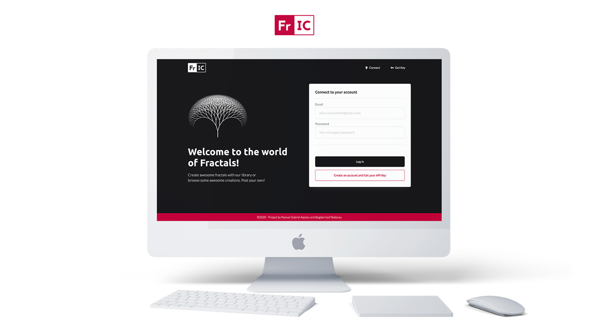

# fii-staw

# Project for STAW course 2019-2020 (UAIC Cuza 2020, Faculty Of Computer Science)

 
[Video Demo (YouTube)](https://youtu.be/hkczR_cN1eE) 

[FrIC Live Demo (hosted on AWS)](http://www.fii-staw.com.s3-website.eu-west-2.amazonaws.com/app/) 

[SCHOLARLY Documentation (~ deprecated)](http://www.fii-staw.com.s3-website.eu-west-2.amazonaws.com/docs/) 

## Library

Find it here:

- `project > library`
- `https://www.npmjs.com/package/fractal-builder/`

## API

API hosted on AWS
Find it here:

- `project > api`

## APP / Platform

APP / Platform hosted on AWS
Find it here:

- `project > app`
- `http://www.fii-staw.com.s3-website.eu-west-2.amazonaws.com/app/`
